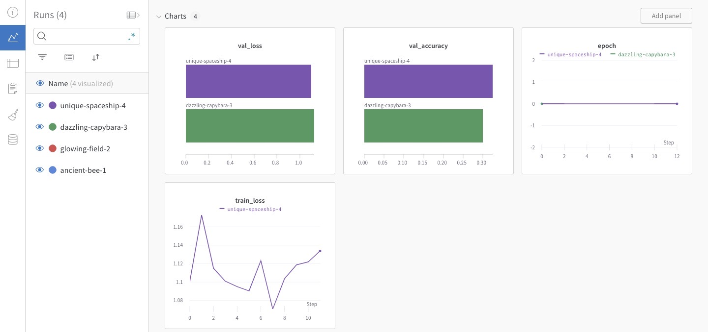
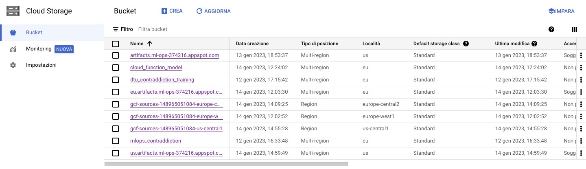
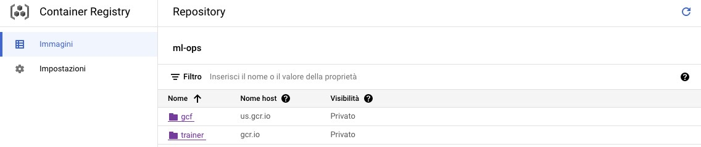
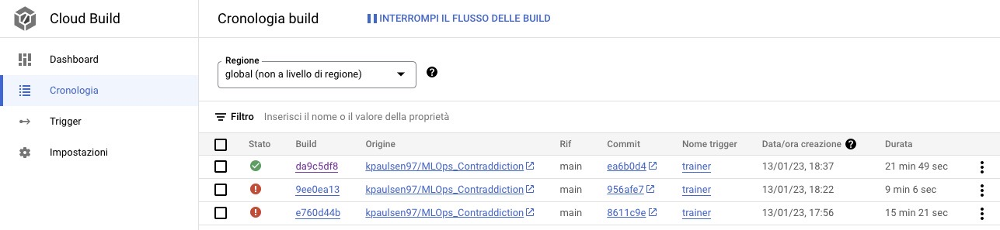
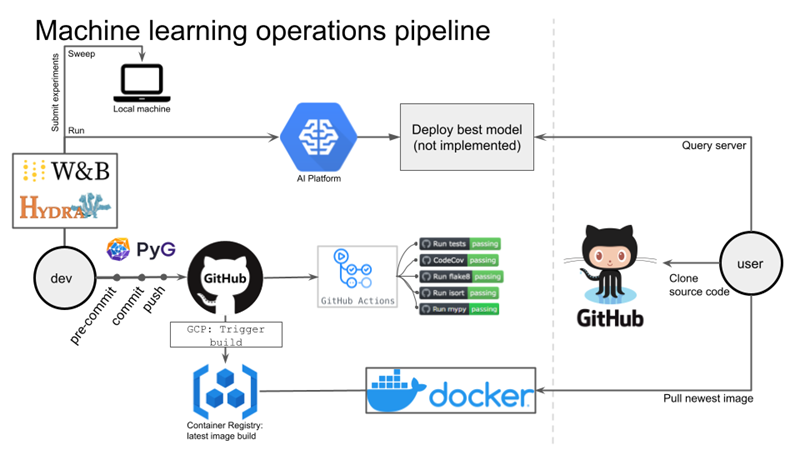

# Exam template for 02476 Machine Learning Operations

This is the report template for the exam. Please only remove the text formatted as with three dashes in front and behind
like:

```--- question 1 fill here ---```

where you instead should add your answers. Any other changes may have unwanted consequences when your report is auto
generated in the end of the course. For questions where you are asked to include images, start by adding the image to
the `figures` subfolder (please only use `.png`, `.jpg` or `.jpeg`) and then add the following code in your answer:

```markdown

```

In addition to this markdown file, we also provide the `report.py` script that provides two utility functions:

Running:

```bash
python report.py html
```

will generate an `.html` page of your report. After deadline for answering this template, we will autoscrape
everything in this `reports` folder and then use this utility to generate an `.html` page that will be your serve
as your final handin.

Running

```bash
python report.py check
```

will check your answers in this template against the constrains listed for each question e.g. is your answer too
short, too long, have you included an image when asked to.

For both functions to work it is important that you do not rename anything. The script have two dependencies that can
be installed with `pip install click markdown`.

## Group information

### Question 1
> **Enter the group number you signed up on <learn.inside.dtu.dk>**
>
> Answer:

9

### Question 2
> **Enter the study number for each member in the group**
>
> Example:
>
> *sXXXXXX, sXXXXXX, sXXXXXX*
>
> Answer:

s213291, s213290

### Question 3
> **What framework did you choose to work with and did it help you complete the project?**
>
> Answer length: 100-200 words.
>
> Example:
> *We used the third-party framework ... in our project. We used functionality ... and functionality ... from the*
> *package to do ... and ... in our project*.
>
> Answer:

We used the third party framework Transformers, in particular the model we decided to use to complete the project was XLMRoberta, which is a model designed to handle multilingual text, therefore suitable for our project which had data of different languages. The variant we chose is called XLMRobertaForSequenceClassification. 
The model inherits from different submodels, by using the method from_pretrained. In this project we choose to inherit "xlm-roberta-base".
To tokenize the phrases we used XLMRobertaTokenizer, which is a tokenizer used specifically for XLMRoberta. The library XLMRobertaTokenizer containes still another method called from_pretrained which receives as input the same submodel as before. 
After having created an instance of XLMRobertaTokenizer, we generate batches of inputs through the method batch_encode_plus.


## Coding environment

> In the following section we are interested in learning more about you local development environment.

### Question 4

> **Explain how you managed dependencies in your project? Explain the process a new team member would have to go**
> **through to get an exact copy of your environment.**
>
> Answer length: 100-200 words
>
> Example:
> *We used ... for managing our dependencies. The list of dependencies was auto-generated using ... . To get a*
> *complete copy of our development enviroment, one would have to run the following commands*
>
> Answer:

We created a new environment for this specific project, and we would install the dependencies required for every task whenever we needed a particular library or package.
By the end of the project we run the command in our root folder "pipreqs .", which detected the needed libraries to replicate our project and therefore created a file requirements.txt with the names of the libraries coupled with the specific version used. 
The process a new team member would have to go through to get an exact copy of our environment would be to create a new environment through conda create -n <name of the environment>, downdload our requirements.txt file and execute in the terminal pip install requirements.txt.

### Question 5

> **We expect that you initialized your project using the cookiecutter template. Explain the overall structure of your**
> **code. Did you fill out every folder or only a subset?**
>
> Answer length: 100-200 words
>
> Example:
> *From the cookiecutter template we have filled out the ... , ... and ... folder. We have removed the ... folder*
> *because we did not use any ... in our project. We have added an ... folder that contains ... for running our*
> *experiments.*
> Answer:

We initialized the initial structure using cookiecutter template. Of the created folders, we used only data and src as major subfolders, and in src we used all the folders except visualization.
In src we have the most of the code and data pipeline: in src/data/make_dataset.py the dataset is downloaded, processed in src/features/build_features.py and afterwards included in the dataset class in src/data/dataset.py. 
The training is done in src/models/train_model.py, and the model is contained in src/models/model.py. In the same folder there is a predicted_model.py which is used to make a prediction. 
In config we have the configuration parameters of Hydra. In tests the test of the code. 
And in src/cloud_function there is the content of the function uploaded on gcp. 
Finally there are other files for docker like trainer-local.docker and cloudbuild.yaml. 

### Question 6

> **Did you implement any rules for code quality and format? Additionally, explain with your own words why these**
> **concepts matters in larger projects.**
>
> Answer length: 50-100 words.
>
> Answer:

We often checked with flake8 in multiple scripts how pep8 compliant we were, and tried to correct the minor errors it was giving. 
In larger projects this is important because having a common style between multiple contributors would aid in the homogeneity of the code and therefore how readable it is. 

## Version control

> In the following section we are interested in how version control was used in your project during development to
> corporate and increase the quality of your code.

### Question 7

> **How many tests did you implement?**
>
> Answer:

We implemented two tests: one for the model, and the other one for the data.
The data test checked if the dimention of the data was as expected and if it is present. 
And for the model we checked if the output was as expected in terms of dimention, and if the heredited model was XLMRobertaForSequenceClassification if we gave him a wrong one. 

### Question 8

> **What is the total code coverage (in percentage) of your code? If you code had an code coverage of 100% (or close**
> **to), would you still trust it to be error free? Explain you reasoning.**
>
> **Answer length: 100-200 words.**
>
> Example:
> *The total code coverage of code is X%, which includes all our source code. We are far from 100% coverage of our **
> *code and even if we were then...*
>
> Answer:

The total code coverage of our project is 62%, which includes all of our source code. Most of our python files in the report however were close to 100%, except for model.py which is very low. This suggests us that the tests are strong enough for most of our code, except for model.py, therefore to be more secure we should add other tests to include that part.
However tests in general are never perfect, and they provide just a certain degree of safety but never 100% (even if the coverage might be so), therefore it is better to never be completely sure that the code is bug proof. 

### Question 9

> **Did you workflow include using branches and pull requests? If yes, explain how. If not, explain how branches and**
> **pull request can help improve version control.**
>
> Answer length: 100-200 words.
>
> Example:
> *We made use of both branches and PRs in our project. In our group, each member had an branch that they worked on in*
> *addition to the main branch. To merge code we ...*
>
> Answer:

Since we are just two people, in this project we didn't use as much branches and pull requests as it would have been needed in a bigger group. 
in such a bigger group branches and pull requests would help a lot for version control because it would allow to multiple people to work on the same project without overlapping each other and therefore merge in one centralized file all the content, which would be the github repository. 
Everyone would work on their share of the code in a local branch of his PC, and periodically push it to the centralized repository.  

### Question 10

> **Did you use DVC for managing data in your project? If yes, then how did it improve your project to have version**
> **control of your data. If no, explain a case where it would be beneficial to have version control of your data.**
>
> Answer length: 100-200 words.
>
> Example:
> *We did make use of DVC in the following way: ... . In the end it helped us in ... for controlling ... part of our*
> *pipeline*
>
> Answer:

DVC helped us greatly in using version control of our data. Since the amount of data was too heavy for github, we wouldn't have had the chance to version control it if it weren't for DVC. Furthermore, since we wanted to upload the model as well, so someone could use it without having to go through the training, DVC helped us upload that too even though it was more then 1GB heavy. 
In our case we initially used google drive as storage, but afterwards switched to GCP as it provided us with more space. 
DVC helped us also with all the docker images, as it was very simple to upload the data with a dvc pull from the image itself. 

### Question 11

> **Discuss you continues integration setup. What kind of CI are you running (unittesting, linting, etc.)? Do you test**
> **multiple operating systems, python version etc. Do you make use of caching? Feel free to insert a link to one of**
> **your github actions workflow.**
>
> Answer length: 200-300 words.
>
> Example:
> *We have organized our CI into 3 separate files: one for doing ..., one for running ... testing and one for running*
> *... . In particular for our ..., we used ... .An example of a triggered workflow can be seen here: <weblink>*
>
> Answer:

We made use of CI through unittesting, in particular we automated the tests on the model and data on every push to the repository.
An example of a workflow is the following: https://github.com/kpaulsen97/MLOps_Contraddiction/actions/runs/3959665773
In this run we can see how initially it defines when the workflow will be triggered, so on push and pull_requests on the master and main branches. Afterwards it sets up the os, python environment. Finally it autheticates to google cloud through a JSON key of a service account linked to our project on GCP, where the data is stored. And so it installs the requirements, pulls the data, and runs the pytests. In this particular instance linked, we can see that everything went well. 
Another CI we made use of was the automated creation of docker images uploaded on GCP. So for every push to the repository, it would run cloudbuild.yaml, which would build a docker image through trainer_cloud.dockerfile, and push it on our project in GCP. 
trainer_cloud.dockerfile is creating an image with a python environment, uses the default service account on GCP, installs dvc to be able to pull the data, and alter copies the required files to run the training and runs docker_run_training.sh as an entrypoint. The sh file will pull the data from dvc and run the scripts to create the data and train the model.

## Running code and tracking experiments

> In the following section we are interested in learning more about the experimental setup for running your code and
> especially the reproducibility of your experiments.

### Question 12

> **How did you configure experiments? Did you make use of config files? Explain with coding examples of how you would**
> **run a experiment.**
>
> Answer length: 50-100 words.
>
> Example:
> *We used a simple argparser, that worked in the following way: python my_script.py --lr 1e-3 --batch_size 25*
>
> Answer:

We used hydra to configure the parameters of our project. in config there was default_config.yaml which contained the link of the folders of other parameters, and in these other folders there were further yaml files which contained the specific parameters for the function. The folders were data, model, predict, build_features and train.

### Question 13

> **Reproducibility of experiments are important. Related to the last question, how did you secure that no information**
> **is lost when running experiments and that your experiments are reproducible?**
>
> Answer length: 100-200 words.
>
> Example:
> *We made use of config files. Whenever an experiment is run the following happens: ... . To reproduce an experiment*
> *one would have to do ...*
>
> Answer:

To reproduce our runs they would need to copy the parameters included in config and use them to run the code.
By having used config files we were able to separate the code from the single parameters used, therefore improving the reproducibility. 
An example on how to run one, would be to simply copy our repository and run from the root base python src/models/train_model.py, while having chosen the desired parameters in config/train/train_config.yaml

### Question 14

> **Upload 1 to 3 screenshots that show the experiments that you have done in W&B (or another experiment tracking**
> **service of your choice). This may include loss graphs, logged images, hyperparameter sweeps etc. You can take**
> **inspiration from [this figure](figures/wandb.png). Explain what metrics you are tracking and why they are**
> **important.**
>
> Answer length: 200-300 words + 1 to 3 screenshots.
>
> Example:
> *As seen in the first image when have tracked ... and ... which both inform us about ... in our experiments.*
> *As seen in the second image we are also tracking ... and ...*
>
> Answer:



From this image we can see four runs: blue, red, green and purple. The first two attempts that we did, the blue one and the red one, results in no output graph on W&B page due to some errors in our train_model.py file related to the incorporation of Wandb in it. After these two attempts we managed to fix these issues and we were able to run the train_model.py file. As can be seen in the image, the green run resulted in partially complete graphs and this was due to the number of batches used to run it, which was around 50 for a total of a couple of minutes. Finally, as can be seen with the purple run, we were able to run the training completely and successfully with 650 batches for around 24 hours. It resulted in four graphs on the W&B page: validation loss and accuracy, number of epochs and train loss. We are able to partially see how the purple run resulted in a slightly smaller validation loss and in a better validation accuracy. In addition, from the graph of the train loss we can see how it increased and decreased in an oscillating trend a couple of times and that is because, in the way we structured our model, the training of the transformer we decided to use (XLMRobertaForSequenceClassification) wasn't as successful as we hoped and therefore the consequent predictions are not reliable with a high degree of certainty. In conclusion, a further study and implementation of another transformer that better fits the data could have been done. 

### Question 15

> **Docker is an important tool for creating containerized applications. Explain how you used docker in your**
> **experiments? Include how you would run your docker images and include a link to one of your docker files.**
>
> Answer length: 100-200 words.
>
> Example:
> *For our project we developed several images: one for training, inference and deployment. For example to run the*
> *training docker image: `docker run trainer:latest lr=1e-3 batch_size=64`. Link to docker file: <weblink>*
>
> Answer:

In our project we developed one image for training the model, as we believe that would have been the most useful image as it would run the most complex code, compared to the others. 
The docker file which would create an image locally is trainer-local.dockerfile https://github.com/kpaulsen97/MLOps_Contraddiction/blob/main/trainer-local.dockerfile, which creates a python environment, copies the necessary files to run the training, as finally starts the train_model.py, by using it as entrypoint. Afterwards, to run the image, you type in the cmd "docker run trainer:latest" and it will give the the container which will have the trained model inside. 

### Question 16

> **When running into bugs while trying to run your experiments, how did you perform debugging? Additionally, did you**
> **try to profile your code or do you think it is already perfect?**
>
> Answer length: 100-200 words.
>
> Example:
> *Debugging method was dependent on group member. Some just used ... and others used ... . We did a single profiling*
> *run of our main code at some point that showed ...*
>
> Answer:

For what concerns the debugging process we mainly used the classic old technique of the print statement, which is a quick and easy way of focusing on the chucks of code where the problem happens and seeing where the code failed. On the other hand, since we know is not the best method for debugging in case of larger codes, we tried to use the VS Code build in debugger, which is very easy to initialize and straight forward to use in this editor. 
For what concerns the profiling we didn't try to implement it, but it would have been a good idea to try and use on how machine learning code in order to detect bottlenecks which are places in the code that prevent other processes from performing their best.

## Working in the cloud

> In the following section we would like to know more about your experience when developing in the cloud.

### Question 17

> **List all the GCP services that you made use of in your project and shortly explain what each service does?**
>
> Answer length: 50-200 words.
>
> Example:
> *We used the following two services: Engine and Bucket. Engine is used for... and Bucket is used for...*
>
> Answer:

We used the Cloud storage, the Container registry, the Cloud functions and Monitoring.

- Cloud storage is used to store data in an easily sharable and cheap way and it guarantees that it won't be lost by storing it in multiple locations. In addition it allows accessing the data through an application programming interface (API). 

- Container registry is used as a container for Docker images, but with the advantage that the building process on the Cloud will take less time and large images can be handled better compared to Docker. After creating a "cloud build.yaml" file in our repository, in the Cloud Build page we connected to our Github repository, created a new trigger and after the image was successfully being built and pushed we were able to find it in the Container registry page.

- Cloud functions are used to deploy a model in an easy way thanks to the fact that they are "serverless" and that means that we don't have to take care of the server directly.

- Monitoring is used to setup automatic alerting in order to get a message every time one of our applications are not behaving as expected.


### Question 18

> **The backbone of GCP is the Compute engine. Explained how you made use of this service and what type of VMs**
> **you used?**
>
> Answer length: 50-100 words.
>
> Example:
> *We used the compute engine to run our ... . We used instances with the following hardware: ... and we started the*
> *using a custom container: ...*
>
> Answer:

Among the services offered by GCP we haven't used the Compute Engine, since we trained our model locally and afterwards uploaded the "deployable_model.pt" file in the Cloud Storage service of GCP in order to deploy the model using Cloud Functions.

Compute engine is a very powerful service of GCP. It can be used to create and run virtual machines (VM), that resemble completely separate computers on which we can run processes in the "background" which means that we don't have to depend on this process to be done before doing anything else. This service can be used by creating a new instance in the Compute engine page and being sure to install Python and Pytorch by starting the virtual machine based on specific docker images.

### Question 19

> **Insert 1-2 images of your GCP bucket, such that we can see what data you have stored in it.**
> **You can take inspiration from [this figure](figures/bucket.png).**
>
> Answer:



### Question 20

> **Upload one image of your GCP container registry, such that we can see the different images that you have stored.**
> **You can take inspiration from [this figure](figures/registry.png).**
>
> Answer:



### Question 21

> **Upload one image of your GCP cloud build history, so we can see the history of the images that have been build in**
> **your project. You can take inspiration from [this figure](figures/build.png).**
>
> Answer:



### Question 22

> **Did you manage to deploy your model, either in locally or cloud? If not, describe why. If yes, describe how and**
> **preferably how you invoke your deployed service?**
>
> Answer length: 100-200 words.
>
> Example:
> *For deployment we wrapped our model into application using ... . We first tried locally serving the model, which*
> *worked. Afterwards we deployed it in the cloud, using ... . To invoke the service an user would call*
> *`curl -X POST -F "file=@file.json"<weburl>`*
>
> Answer:

We managed to deploy our model on the cloud. 
Firstly, in the Cloud storage page, we created one bucket to contain the "deployable_model.py" and since we initially configured DVC on Google Drive we had to change the storage from it to the Cloud Storage. Afterwards, in the Cloud functions page, we created a function that takes as input two sentences and outputs the prediction that could be that either the two sentences entails each other, or are unrelated or contradict each other.
To invoke the deployed service a user would call 
curl -m 70 -X POST https://us-central1-ml-ops-374216.cloudfunctions.net/function_cloud -d '{"premise":"X","hypothesis":"Y"}', with X and Y as the two sentences we want to understand the relation.

### Question 23

> **Did you manage to implement monitoring of your deployed model? If yes, explain how it works. If not, explain how**
> **monitoring would help the longevity of your application.**
>
> Answer length: 100-200 words.
>
> Example:
> *We did not manage to implement monitoring. We would like to have monitoring implemented such that over time we could*
> *measure ... and ... that would inform us about this ... behaviour of our application.*
>
> Answer:

We managed to implement Monitoring on our deployed model by setting up automatic alerting in order to get a message every time our application is not behaving as expected. In particular, we created a policy that send us an email every time the log entries of the cloud function exceed 10. 

Monitoring is based on the concept of telemetry and is fundamental for the longevity of an application since it keeps track and collects information and metrics in order to send us an alert such that the model won't perform worse over time due to a lack of generalization, instead it will be retrained based on the recorded changes. 

### Question 24

> **How many credits did you end up using during the project and what service was most expensive?**
>
> Answer length: 25-100 words.
>
> Example:
> *Group member 1 used ..., Group member 2 used ..., in total ... credits was spend during development. The service*
> *costing the most was ... due to ...*
>
> Answer:

Since we didn't utilize the VM for our project, we paid a very low amount of money, namely 25dkk circa in total, which all were used for the Cloud Storage. 

## Overall discussion of project

> In the following section we would like you to think about the general structure of your project.

### Question 25

> **Include a figure that describes the overall architecture of your system and what services that you make use of.**
> **You can take inspiration from [this figure](figures/overview.png). Additionally in your own words, explain the**
> **overall steps in figure.**
>
> Answer length: 200-400 words
>
> Example:
>
> *The starting point of the diagram is our local setup, where we integrated ... and ... and ... into our code.*
> *Whenever we commit code and puch to github, it auto triggers ... and ... . From there the diagram shows ...*
>
> Answer:


The process starts with our local machine, where we have the data pipeline which extract the data from the kaggle api and it proccess it to be included in the desired dataset. 
From there there is the train_model.py that takes the data and transformer and trains it to improve accuracy of the model. 
The model is trained through PyTorch Lightning, which reduces the amount of code to be written and makes therefore our codes more concise. 
The logs of the training are registered through Hydra and Wandb. Hydra outputs the general logs locally, while wandb uploads the loss and accuracies of the model during the training. 
The whole local code structure is uploaded on github, except for the data and trained model which are stored on GCP, pushed and pulled thanks to dvc. 
Whenever we push on the repository, tests on the model and data are triggered on github and it starts to check if they pass. Furthermore, GCP triggers the build of a docker image which trains the model and will be stored on GCP.
On GCP we have deployed a function which takes as input two sentences and checks their relation. Furthermore, we added a monitor to this function which signals us via email if the logs exceeds 10 in number in 5 minutes, as we have witnessed this is the threshold for when it gives issues.
On the user end, he can clone our code on github, pull our data through dvc on GCP, query the function with curl, and pull the docker image which trains the model. 

### Question 26

> **Discuss the overall struggles of the project. Where did you spend most time and what did you do to overcome these**
> **challenges?**
>
> Answer length: 200-400 words.
>
> Example:
> *The biggest challenges in the project was using ... tool to do ... . The reason for this was ...*
>
> Answer:


### Question 27

> **State the individual contributions of each team member. This is required information from DTU, because we need to**
> **make sure all members contributed actively to the project**
>
> Answer length: 50-200 words.
>
> Example:
> *Student sXXXXXX was in charge of developing of setting up the initial cookie cutter project and developing of the*
> *docker containers for training our applications.*
> *Student sXXXXXX was in charge of training our models in the cloud and deploying them afterwards.*
> *All members contributed to code by...*
>
> Answer:

s213291 was in charge of creating the data pipeline, from kaggle to the dataset class, and hydra config files, creation of the function on GCP and docker container triggered on the github push. 
s213290 was in charge of creating the training and test python files, the tests, workflow on github, wandb and local docker images. 
But overall we helped each other on every topic so that we could get a better understanding of everything.
